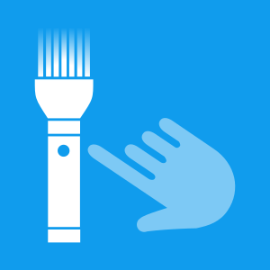
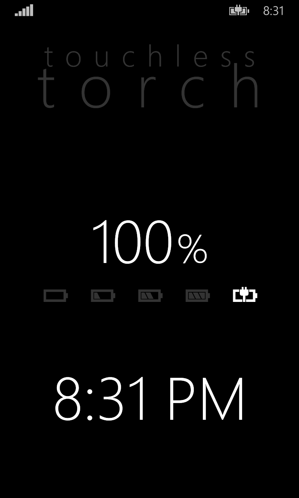
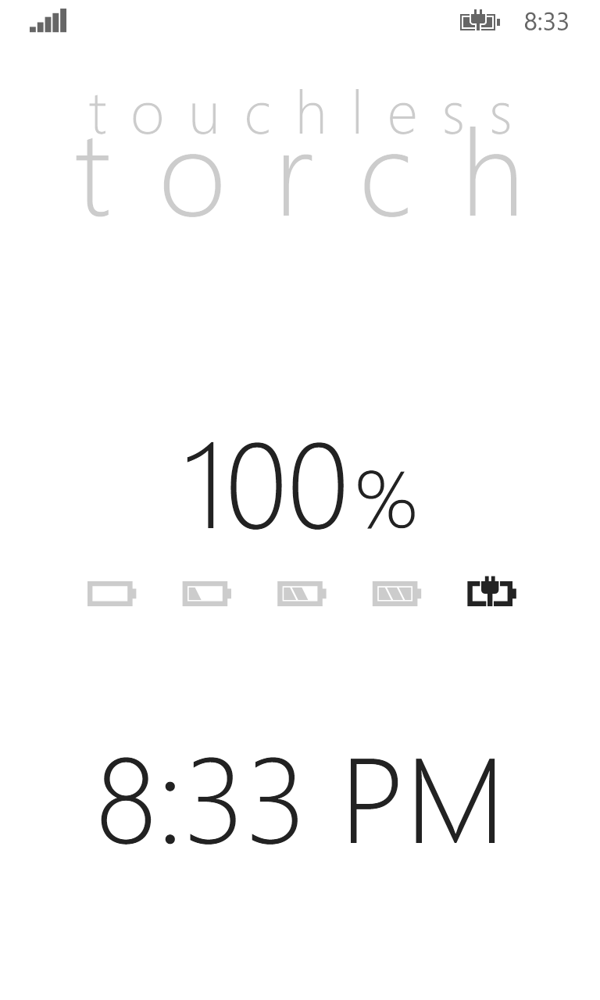

# Touchless Torch

This is a repository containing the sources of the "Touchess Torch" application
I developed in 2015 as one of my first, demo Windows Phone app, developed while working at Nokia.

I published it in 2020 to GitHub to save this wonderful relic.

## Description

    A smart, elegant and minimalistic torch that is so simple to use that doesn't require any user interaction.
    Just start the app and the torch is on. Quit by tapping Back or Start and the torch is off.
    No additional user interaction needed, redundant on/off buttons, and similar.
    A convenient clock and battery level indicator is provided.

## Screenshots

## On Microsoft Store

At the time of writing, the app is still available on Microsoft Store at this URL:

https://www.microsoft.com/store/apps/9NBLGGH1P2V5

It should be available worldwide. It requires a device with Windows Phone 8 or 10.
It's clearly deprecated, as both the operating systems are now deprecated by Microsoft.
